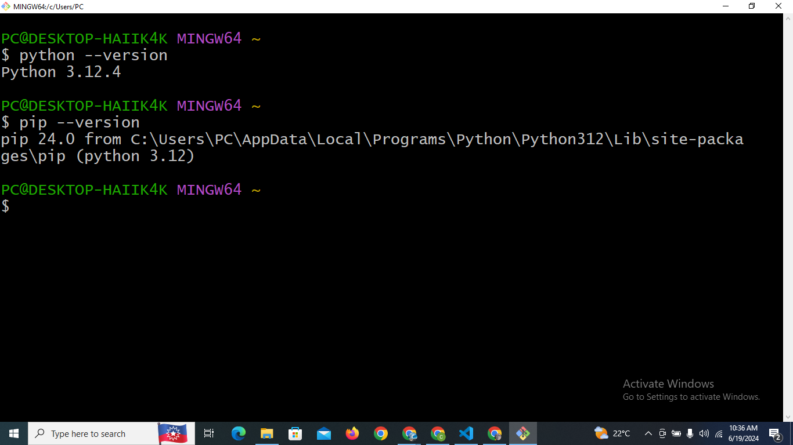
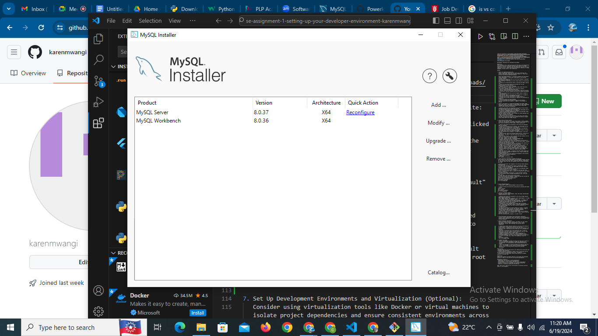
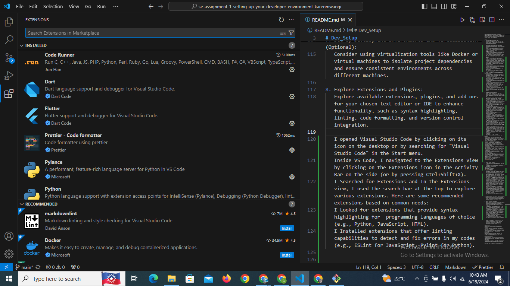

# Dev_Setup
Setup Development Environment

#Assignment: Setting Up Your Developer Environment

#Objective:
This assignment aims to familiarize you with the tools and configurations necessary to set up an efficient developer environment for software engineering projects. Completing this assignment will give you the skills required to set up a robust and productive workspace conducive to coding, debugging, version control, and collaboration.

#Tasks:

1. Select Your Operating System (OS):
   Choose an operating system that best suits your preferences and project requirements. Download and Install Windows 11. https://www.microsoft.com/software-download/windows11

   Before downloading Windows 11, I ensured my computer met the minimum system requirements. I found these requirements on the official Microsoft website.
   I opened my web browser and went to the official Windows 11 download page: Windows 11 Download.
   I scrolled down to the section titled "Create Windows 11 Installation Media".
   I clicked on the "Download Now" button to download the Media Creation Tool.
   I located the downloaded MediaCreationToolW11.exe file and double-clicked it to run the tool.
   I accepted the license terms to proceed.
   I chose the option to "Create installation media (USB flash drive, DVD, or ISO file) for another PC".
   I selected my language, edition, and architecture (64-bit).
   I chose to create a bootable USB flash drive:
   I inserted a USB flash drive with at least 8GB of space and selected it in the tool. The tool formatted the drive and created the bootable media.
   I inserted the USB flash drive into the computer where I wanted to install Windows 11.
   I restarted the computer and booted from the USB drive (I needed to change the boot order in the BIOS/UEFI settings).
   I followed the on-screen instructions to install Windows 11.
   I followed the on-screen instructions to complete the installation of Windows 11.
   I entered the product key when prompted
   I chose my settings and preferences during the setup process.
   Once the installation was complete, I logged in to my Windows 11 desktop.

2. Install a Text Editor or Integrated Development Environment (IDE):
   Select and install a text editor or IDE suitable for your programming languages and workflow. Download and Install Visual Studio Code. https://code.visualstudio.com/Download

   I opened my web browser and navigated to the official Visual Studio Code download page: Visual Studio Code Download.
   I clicked on the download button for Windows. This downloaded the VS Code installer (VSCodeSetup.exe) to my computer.
   I located the downloaded VSCodeSetup.exe file in my Downloads folder.
   I double-clicked the installer to run it.
   When the installer started, I read through the license agreement and clicked "I accept the agreement".
   I then clicked "Next" to continue.
   I waited for the installation to complete. This took a few minutes.
   Once the installation was complete, I checked the option to "Launch Visual Studio Code" and clicked "Finish".

3. Set Up Version Control System:
   Install Git and configure it on your local machine. Create a GitHub account for hosting your repositories. Initialize a Git repository for your project and make your first commit. https://github.com

   I opened my web browser and navigated to the official Git download page: Git Download.
   I clicked on the download link for Windows. This downloaded the Git installer (Git-2.x.x-64-bit.exe) to my computer.
   I located the downloaded Git-2.x.x-64-bit.exe file in my Downloads folder and double-clicked it to run the installer.
   I followed the installation prompts, accepting the default settings, and clicked "Next" until the installation began.
   Once the installation was complete, I clicked "Finish" to exit the installer.
   I opened Git Bash, which was installed along with Git. I did this by searching for "Git Bash" in the Start menu and clicking on the application.
   In the Git Bash terminal, I set my username and email address for Git commits by running the following commands:
   git config --global user.name "karenmwangi"
   git config --global user.email "mawangikarenn@gmail.com"
   I opened my web browser and went to GitHub.
   I clicked on the "Sign up" button and followed the instructions to create a new GitHub account. This included entering my email, creating a password, and choosing a username.
   After completing the sign-up process, I verified my email address by clicking on the verification link sent to my email.
   I logged in to my GitHub account and clicked on the "+" icon in the top-right corner of the page, then selected "New repository".
   I entered a repository name (e.g., demo), provided a description (optional), chose to make the repository public or private, and checked the option to initialize the repository with a README file.
   I clicked on the "Create repository" button to create the new repository.
   On the new repository page, I clicked on the green "Code" button and copied the URL for cloning the repository (e.g., https://github.com/yourusername/demo.git).
   I opened Git Bash on my local machine and navigated to the directory where I wanted to clone the repository:
   cd path/to/your/directory
   cd MyProject
   The I opened in Vs Code by: code .

4. Install Necessary Programming Languages and Runtimes:
  Instal Python from http://wwww.python.org programming language required for your project and install their respective compilers, interpreters, or runtimes. Ensure you have the necessary tools to build and execute your code.

  I opened my web browser and navigated to the official Python website: Python Downloads.
  I clicked on the "Download Python" button to download the latest version of Python for Windows. This downloaded the Python installer (python-x.x.x.exe) to my computer.
  I located the downloaded python-x.x.x.exe file in my Downloads folder and double-clicked it to run the installer.
  On the installer welcome screen, I checked the box that says "Add Python x.x to PATH". This step is crucial as it allows me to use Python from the command line.
  I clicked on "Customize installation" to choose optional features:
  I left the default options checked (Documentation, pip, tcl/tk and IDLE, etc.).
  I clicked "Next" and started installation process
  Once the installation was complete, I opened Git Bash and verified the installation by checking the Python version:
  python --version which was python 3.12.4
  pip --version which was pip 3.12
  deliverable screenshot:
  

5. Install Package Managers:
   If applicable, install package managers like pip (Python).

   I opened Git Bash and verified the installation by checking the Python version:
  python --version
  pip --version
  deliverable screenshot:
 

6. Configure a Database (MySQL):
   Download and install MySQL database. https://dev.mysql.com/downloads/windows/installer/5.7.html

   I opened my web browser and navigated to the official MySQL website: MySQL Community Downloads.
   Under "MySQL Community (GPL) Downloads" under geeksforgeeks, I clicked on the "MySQL Installer for Windows" link.
   This took me to the MySQL Installer download page. I clicked on the "Download" button to download the MySQL Installer to my computer.
   I located the downloaded file in my Downloads folder and double-clicked it to run the installer.
   I accepted the license agreement and clicked "Next" to proceed.
   On the "Choosing a Setup Type" screen, I selected "Developer Default" which includes MySQL Server and other necessary components for development purposes.
   I clicked "Next".
   The installer prompted me to select products to install. I ensured that MySQL Server (latest version) was selected, however, I had to manually download MySQL Workbench for database management.
   I clicked "Next" to proceed with the installation.
   During the installation, I configured MySQL Server with the default options (port number, root password, etc.). I made a note of the root password for future use.
   Once the installation was complete, I clicked "Finish"
   deliverable screenshot;
   

7. Set Up Development Environments and Virtualization (Optional):
   Consider using virtualization tools like Docker or virtual machines to isolate project dependencies and ensure consistent environments across different machines.

8. Explore Extensions and Plugins:
   Explore available extensions, plugins, and add-ons for your chosen text editor or IDE to enhance functionality, such as syntax highlighting, linting, code formatting, and version control integration.

   I opened Visual Studio Code by clicking on its icon on the desktop or by searching for "Visual Studio Code" in the Start menu.
   Inside VS Code, I navigated to the Extensions view by clicking on the Extensions icon in the Activity Bar on the side (or by pressing Ctrl+Shift+X).
   I Searched for Extensions and In the Extensions view, I used the search bar at the top to explore various extensions. Here are some recommended extensions based on common needs:
   I Looked for extensions that provide syntax highlighting for  programming languages of choice (e.g., Python, JavaScript, HTML).
   I Installed extensions that offer linting capabilities to detect and fix errors in my codes (e.g., ESLint for JavaScript, Pylint for Python).
   deliverable screenshot
   

9. Document Your Setup:
    Create a comprehensive document outlining the steps you've taken to set up your developer environment. Include any configurations, customizations, or troubleshooting steps encountered during the process. 
    I had a few challenges in setting up python and creating a path for it but i soon managed to after clearly following the guidelines. Overall it was an exciting process setting up my developer environment.  

#Deliverables:
- Document detailing the setup process with step-by-step instructions and screenshots where necessary.
- A GitHub repository containing a sample project initialized with Git and any necessary configuration files (e.g., .gitignore).
- A reflection on the challenges faced during setup and strategies employed to overcome them.

#Submission:
Submit your document and GitHub repository link through the designated platform or email to the instructor by the specified deadline.

#Evaluation Criteria:**
- Completeness and accuracy of setup documentation.
- Effectiveness of version control implementation.
- Appropriateness of tools selected for the project requirements.
- Clarity of reflection on challenges and solutions encountered.
- Adherence to submission guidelines and deadlines.

Note: Feel free to reach out for clarification or assistance with any aspect of the assignment.
